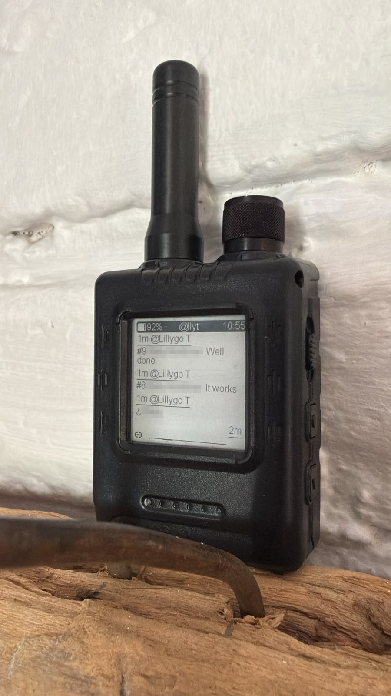
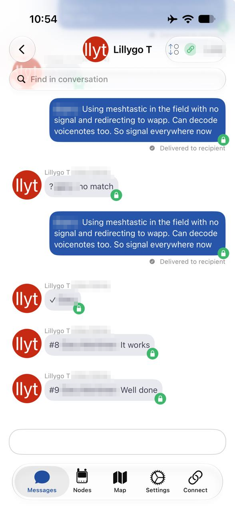
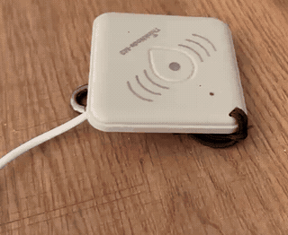
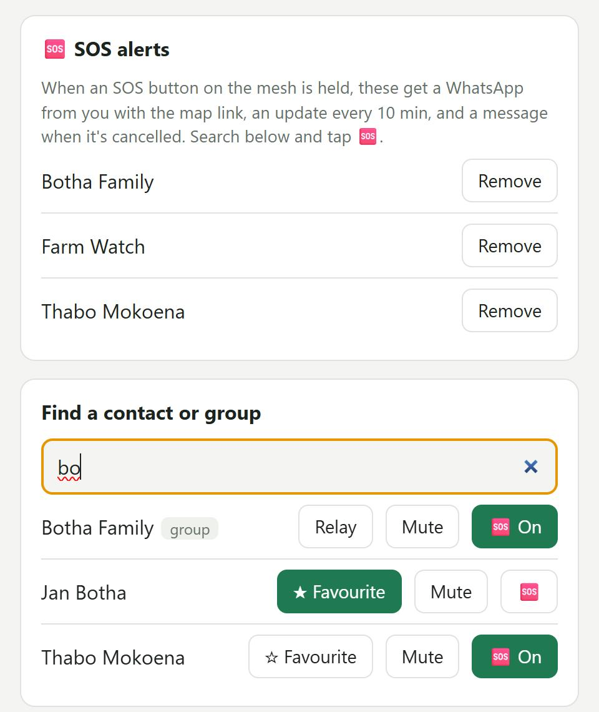
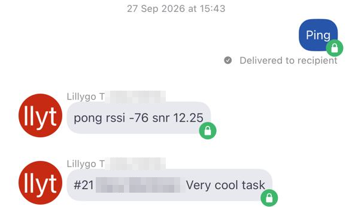
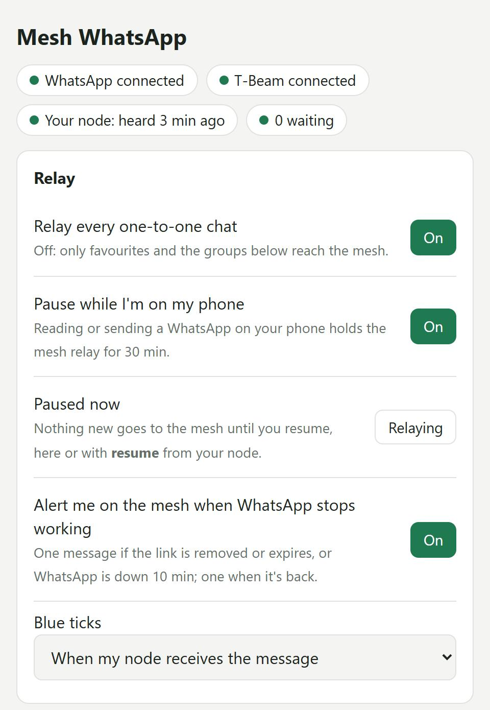

# veld-bridge: WhatsApp over LoRa, for places with no signal

On a farm the house usually has internet, but out in the lands, the kloofs and the veld
there's often no cell signal at all. And WhatsApp is how people here actually reach
each other: family, workers, neighbours, the farm-watch group.

**veld-bridge** connects the two. An always-on box at the house (a NAS or a Raspberry
Pi) is linked to your WhatsApp as a *linked device*, and a [Meshtastic](https://meshtastic.org)
LoRa radio carries your messages out into the field:

- **Read and answer your WhatsApp from a pocket radio.** New messages reach your node in
  short form (`#3 Sam: see you at 5`). You reply with `@3 on my way`, and it lands in the
  right chat as you. When you're back in signal, your phone shows a normal, consistent
  chat history.
- **[SOS to WhatsApp](#-sos-a-panic-button-that-reaches-whatsapp).** When someone holds
  the SOS button on a [ThinkNode SOS](https://github.com/veld-mesh/thinknode-sos) radio,
  the people and groups you choose get a WhatsApp alert with a map link. They get location
  updates every 10 min and a message when it's cancelled. Nobody on the receiving end
  needs a radio or an app.
- **Knows when you're on your phone.** Read or send a WhatsApp on your phone and the
  bridge stops duplicating messages to the radio until you've been off it for 30 min.

<p align="center">
  
  &nbsp;
  
</p>
<p align="center"><sub>WhatsApp replies arriving on a pocket radio in the field (left), and the same chat in the Meshtastic app (right). Names are blurred for privacy.</sub></p>

Beyond emergencies it's handy every day: farm-watch patrols, coordinating work, or
getting everyone together for a braai after work.

> **Coming next: Signal and Telegram.** The WhatsApp side is a thin adapter behind a small
> socket protocol, so other messengers can plug into the same core.

```
WhatsApp ── wa/ (Node, whatsapp-web.js) ──unix socket── core/ (Python) ── T-Beam ~~LoRa~~ pocket node
```

## 🆘 SOS: a panic button that reaches WhatsApp

```
hold 3 s ─► ThinkNode SOS radio ~~LoRa mesh~~ gateway ─► veld-bridge ─► WhatsApp: family, farm-watch group…
```

<p align="center">
  
  &nbsp;
  
</p>
<p align="center"><sub>Holding the SOS button on a ThinkNode M3 (left). Picking who gets the WhatsApp alert on the admin page (right, demo data).</sub></p>

1. **Someone in the field holds the button** on a ThinkNode M3 running
   [ThinkNode SOS](https://github.com/veld-mesh/thinknode-sos) for 3 seconds. The beeps
   speed up, then a loud tone confirms it. Letting go early sends nothing, so a bump
   doesn't set it off.
2. **The radio alerts the mesh.** It sends `🆘 SOS Bert! -30.12345,25.12345 <maps link>` on
   your channel and drops a 🆘 pin on everyone's Meshtastic map. It repeats every
   2 minutes. Other SOS radios sound a loud alarm.
3. **veld-bridge WhatsApps the people you chose.** Tick them under **🆘 SOS alerts** on the
   [admin page](#admin-page). They can be people or whole groups, and nobody needs a radio or an app:

   > 🆘 **Mesh SOS alert** (14:05)
   > SOS Bert! -30.12345,25.12345 https://maps.google.com/?q=-30.12345,25.12345
   >
   > Automatic message from the farm radio mesh. Location updates follow every 10 min until it's cancelled.

4. **Updates and cancel.** Updated locations go out at most every 10 min. Holding the button
   for 3 s again cancels the SOS: the pin disappears and everyone gets `✅ Mesh SOS cancelled`.

**Details:**

- An SOS from **any** node on your channel counts, not just yours.
- Only WhatsApp contacts and groups can be picked, so the bridge never messages a stranger.
- Each WhatsApp sent is confirmed on your pocket node as `✓ SOS Thabo`.
- If nobody is ticked, your node gets `⚠ SOS heard, no WhatsApp SOS recipients set`.
- If WhatsApp is offline, alerts are queued and sent when it's back.

## ⚠️ Read this first

- **This uses an unofficial WhatsApp client**
  ([whatsapp-web.js](https://github.com/pedroslopez/whatsapp-web.js), driving WhatsApp Web
  in a headless browser). It is not affiliated with or endorsed by WhatsApp or Meta.
  Automating a personal account may go against WhatsApp's terms, and **WhatsApp can
  restrict or ban numbers it thinks are automated.** The bridge tries hard to behave like
  a person: it only reacts to events, sends at human pace, and never starts a chat with
  someone who hasn't written to you unless you've added them yourself. Even so, **use it at
  your own risk**, ideally not on a number you can't afford to lose.
- **It is not an emergency service.** Alerts depend on the mesh, the house internet,
  power, and WhatsApp all working. Test it, and keep other ways to call for help.
- Your WhatsApp session lives on the bridge host. Treat that folder like a password (see
  [Back up the session](#back-up-the-whatsapp-session)).

## What you need

- **An always-on host at the house with internet**: a NAS with Docker (tested on a
  Synology DS920+), or a Linux box / Raspberry Pi with **at least 2 GB of RAM**. Chromium
  is too heavy for a 1 GB Pi 3.
- **A gateway Meshtastic node** on USB to that host (tested with a LILYGO T-Beam).
- **A pocket node** for you (tested with an Elecrow ThinkNode M1). Get its node id from
  `meshtastic --nodes`.
- **A private Meshtastic channel** shared by your nodes.

## In the field (cheat sheet)

DM these to the gateway node from your pocket node:

| You send | Bridge does |
|---|---|
| `r` | next waiting message in full (split `[1/3]`…) |
| `r 4` / `r sam` | message #4 / latest from Sam, in full |
| `@4 text` | reply into #4's chat → `✓ Sam` or `✗ Sam: reason` |
| `@sam text` | reply to Sam (must be unique, else `? sam: Sam Smith, Samantha K`) |
| `text` | reply to the chat you last read or replied to |
| `l` | list waiting |
| `mute sam` / `unmute sam` | stop / resume relaying that chat |
| `all on` / `all off` | every 1:1 chat / allowlist only |
| `s` | status: WA, queue, last ack RTT, uptime, pause |
| `ping` | `pong rssi -97 snr 6.5` (range test) |
| `pause` / `resume` | stop sending new WhatsApps to the node / start again (`▶ resumed, 3 waiting`) |



Incoming messages look like `#3 Sam: see you at 5`. Media shows as `[photo] caption`,
`[voice 0:42]`, `[pdf: name]` or `[loc] lat,lon`. A long message is cut off with `…`.
Send `r 3` to get all of it.

When you come back into range, you get `5 waiting: Sam×2, Alex, Jo, Kim — r to read`
first. Then up to 10 messages arrive, oldest first, one every 10 s. If there are more,
you get `+7 more, r for next`. Every packet is a DM with a delivery ack, retried if
it isn't acked. The bridge never sends more than one packet every 10 s, to save
airtime.

**Blue ticks** follow `relay.mark_seen`:

- `ack` marks the chat read when your node acks the message.
- `read` waits until you pull it with `r`.
- `never` leaves every chat unread for your phone.

Nothing is ever marked read just because it arrived.

**Reading on your phone.** If you read a chat on your phone (or WhatsApp Web) while its
messages are still waiting for the mesh, they're dropped from the queue, so you won't get
them twice. **Phone pause:** reading or sending a WhatsApp on your phone tells the bridge
you have WhatsApp there. It stops sending new messages to the node until 30 min after your
last phone activity (`relay.phone_pause_s`, and a switch on the admin page). Then anything
you haven't read arrives as usual. The bridge's own sends (your mesh replies, SOS alerts)
don't count. `pause` holds the relay until `resume`, and `resume` also ends a phone pause.

**Who you can reply to.** Replies only go to chats that have written to you, or to
**favourites** (set on the admin page or in `relay.allowlist`). The bridge never starts a
chat with anyone else. Favourites let `@jan hi` work before Jan has written. History that
WhatsApp replays on link/reconnect is never relayed: nothing sent before the first link,
and nothing older than `relay.max_age_s` (6 h).

**SOS alerts** need no commands. See [SOS: a panic button that reaches WhatsApp](#-sos-a-panic-button-that-reaches-whatsapp).

## Admin page



`http://<host>:8787/` on your LAN. Any username works, and the password is
`health.admin_password`. From the page you can:

- search contacts and groups, favourite people, relay groups, and mute chats
- pick **SOS recipients**
- switch relay-all, blue ticks, the phone pause and the "WhatsApp stopped" mesh alert
- pause and resume the relay
- relink WhatsApp (the QR shows there when it's needed)

The page never shows message text. `/health` on the same port returns JSON for
monitoring. **Never port-forward port 8787 to the internet.** For remote access, use a VPN such
as Tailscale or WireGuard.
<br clear="right">

## Install with Docker (NAS or any Docker host)

```
<data>/veld-bridge/          e.g. /volume1/docker/veld-bridge on Synology
  src/      this repo, plus .env with VB_MESH_DEV=/dev/ttyACM0 (or ttyUSB0)
  config/   config.yaml (from config.example.yaml), wa.env (from deploy/wa.env.example)
  state/    bridge.db, wa-session/     keep 0700: wa-session IS your linked device
  run/      wa.sock between the two containers
```

1. Create the folders. Copy the repo into `src/` and the two config files into
   `config/`. Set `mesh.serial_path: /dev/ttyMESH`, `mesh.pocket_node`, and
   `health.admin_password`.
2. Put the gateway's serial device in `src/.env` as `VB_MESH_DEV=...`. On Synology DSM, run
   `deploy/nas/usb-check.sh` to find it. DSM doesn't load USB serial drivers by itself, and the
   script shows the `insmod` line to add as a boot-up task.
3. Run `sudo docker compose up -d --build` in `src/`. If your folders aren't under
   `/volume1/docker`, change the paths in `compose.yaml` to match.
4. **Link WhatsApp:** open the admin page (or `docker compose logs wa`) and scan the QR code
   from your phone: WhatsApp → Settings → Linked devices → Link a device.
5. **Pin WhatsApp Web:** after `WhatsApp ready`, the log prints the WA Web version. Put it in
   `WA_WEB_VERSION=` in `config/wa.env`, so a WhatsApp Web update can't change the bridge's
   behaviour without warning.

To update from a laptop checkout, run `VB_HOST=user@nas deploy/nas/push.sh [core] [wa]`. It copies
the committed code, then rebuilds and restarts only the services you name. `push.sh core`
leaves WhatsApp linked. Logs are JSON: `sudo docker compose logs -f core wa`.

## Install on a Linux host / Raspberry Pi (systemd)

```sh
git clone https://github.com/veld-mesh/veld-bridge.git
cd veld-bridge && sudo ./install.sh
```

This installs Node 22, apt `chromium`, a Python venv, the two systemd units
(`veld-bridge-core`, `veld-bridge-wa`) and `/etc/veld-bridge/{config.yaml,wa.env}`.
It is safe to re-run. The service user defaults to `pi` (`VB_USER=...` to change it).

**Find the serial path and node ids.** The core holds the serial port, so stop it first:

```sh
sudo systemctl stop veld-bridge-core
ls -l /dev/serial/by-id/                          # the gateway, e.g. usb-Silicon_Labs_CP2102...-if00-port0
/opt/veld-bridge/venv/bin/meshtastic --port /dev/serial/by-id/<that> --nodes   # your pocket node's id, e.g. !a1b2c3d4
```

Put both values in `/etc/veld-bridge/config.yaml` (`mesh.serial_path`, `mesh.pocket_node`),
then check the config and start the core:

```sh
/opt/veld-bridge/venv/bin/veldbridge --config /etc/veld-bridge/config.yaml --check
sudo systemctl start veld-bridge-core
journalctl -u veld-bridge-wa -f      # scan the QR code shown here (also saved at /var/lib/veld-bridge/qr.png)
```

Pin WA Web the same way as above, in `/etc/veld-bridge/wa.env`, then run
`sudo systemctl restart veld-bridge-wa`. Update with `sudo /opt/veld-bridge/app/deploy.sh`.

## Smoke test

1. `curl -s http://<host>:8787/health` should show `"wa": "CONNECTED"` and `"mesh_connected": true`.
2. From your pocket node, DM the gateway `ping`. You should get `pong rssi … snr …` back.
3. Ask someone to WhatsApp you. `#1 Name: …` should arrive on your node within about 10 s.
4. Reply `@1 test from the mesh`. You should get `✓ Name`, and your phone shows the reply as sent by you.

## Back up the WhatsApp session

`state/wa-session` (Docker) or `/var/lib/veld-bridge/wa-session` (systemd) **is your
linked device**. Keep it at mode 0700, and never commit it or copy it anywhere you don't
trust. To back it up, stop `wa`, run `tar -czf wa-session-$(date +%F).tgz wa-session`,
and start `wa` again. If the session is lost, just scan a new QR. You can also remove the
bridge at any time from your phone: WhatsApp → Linked devices.

## Development (no hardware needed)

```sh
cd core && pip install -e '.[dev]' && ruff check . && pytest -q
cd wa && PUPPETEER_SKIP_DOWNLOAD=1 npm ci && npm test
```

Everything runs against `FakeMesh`, `FakeWhatsApp` and `FakeClock`
(`core/src/veldbridge/transports.py`). The Node adapter is tested against a fake core
socket and a fake `Client`. `veldbridge --fake-mesh` runs the real process with no radio.
[docs/ADR-001-layout.md](docs/ADR-001-layout.md) explains the two-process design.

| File | What |
|---|---|
| `core/src/veldbridge/text.py` | compaction, emoji strip, byte truncation, `[i/n]` chunking |
| `core/src/veldbridge/commands.py` | command parser |
| `core/src/veldbridge/outbox.py` | airtime limiter + ack/retry state machine |
| `core/src/veldbridge/bridge.py` | filter, presence, probe, digest, commands, replies, SOS, pause |
| `core/src/veldbridge/mesh_serial.py` | gateway adapter + serial watchdog |
| `core/src/veldbridge/wa_socket.py` | NDJSON socket server for `wa/` |
| `core/src/veldbridge/admin.py` | admin page API |
| `wa/src/adapter.js` | whatsapp-web.js lifecycle, watchdog, requests |

## Licence

GPL-3.0. See [LICENSE](LICENSE). It builds on the
[Meshtastic Python library](https://github.com/meshtastic/python) (GPL-3.0) and
[whatsapp-web.js](https://github.com/pedroslopez/whatsapp-web.js) (Apache-2.0).
WhatsApp is a trademark of Meta Platforms, Inc. Meshtastic® is a registered trademark of
Meshtastic LLC. This project is not affiliated with or endorsed by either.
